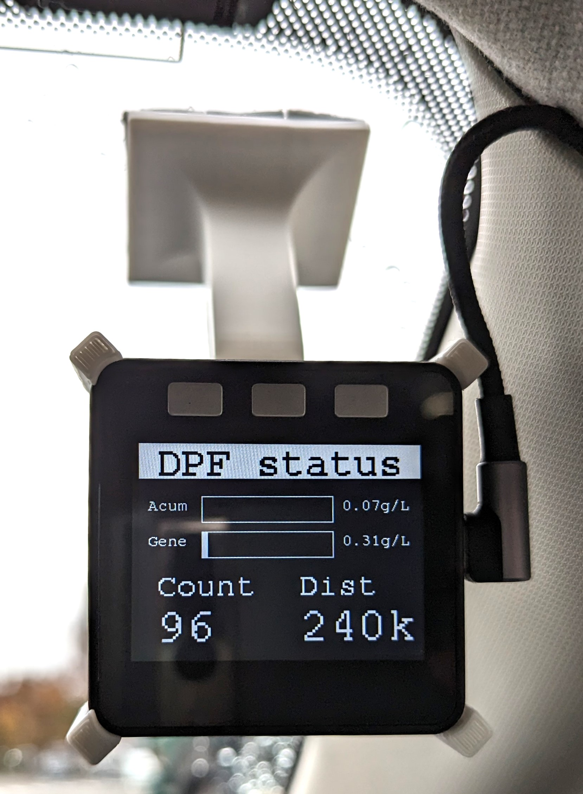
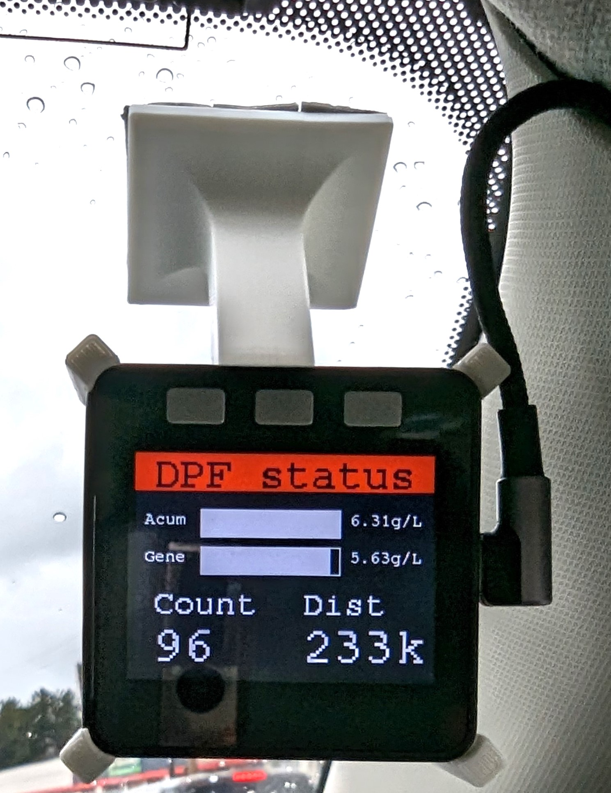

# このプロジェクトは
このプロジェクトはM5stackで動作する、車両の情報をLCDに表示するソフトウェアです。

# 機能
- 気圧から高度を計算し、表示します。
- (Mazdaディーゼル車のみ)DPFのステータスをbluetooth OBD2アダプタから取得し、表示します。

# ビルド方法
- vscodeとPlatformIOをインストールします。
- ビルドします。

# 使い方
- ボタンAとボタンCで基準気圧を設定できます。
- ボタンBで高度表示画面とDPF表示画面を切り替えます。

# 表示
- 高度表示画面
  - TBD
- DPF表示画面
    
    