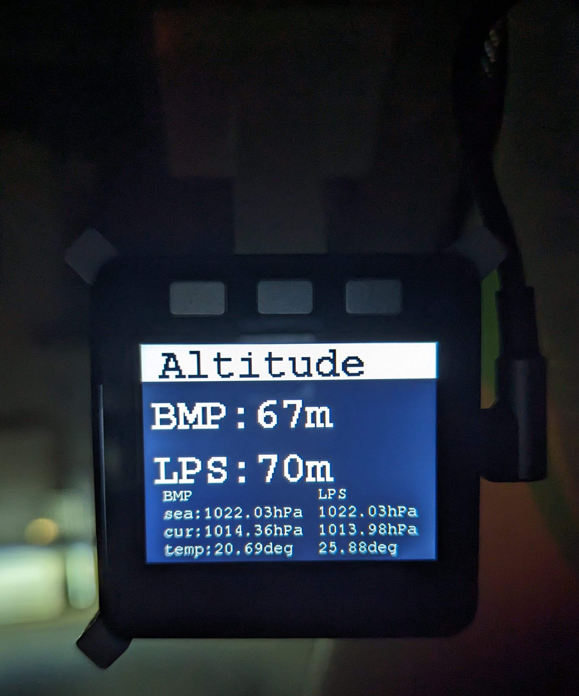

## 概要

### このプロジェクトは

このプロジェクトは M5stack で動作する、車両の情報、気圧高度を LCD に表示するソフトウェアです。

### 機能

- 気圧から高度を計算し、表示します。
- (Mazda ディーゼル車のみ)DPF のステータスを bluetooth OBD2 アダプタから取得し、表示します。

### 表示

- 概要表示
  - 
- メーター表示
  
- DPF ステータス表示
  
- 気圧高度表示
  
- 設定表示
  - 気圧高度の気圧ソースを設定します。(センサ or OBD2 による外気温)
    

### 使い方

- ボタン A とボタン C で基準気圧を設定できます。
- ボタン B で画面を切り替えます。

## 開発

### 開発環境

必要ハードウェア

- M5Stack
- BMP280
- OBD2 アダプタ(bluetooth)
- 固定ホルダー(オプション。3D プリント用のデータは STL フォルダにあります。)

ソフトウェア

- vscode
- PlatformIO

### ビルド方法

- vscode と PlatformIO をインストールします。
- ビルドします。

### 貢献

- プルリクエストを歓迎します。
- バグ報告、要望は issue にお願いします。対応するとは限りません。

### 固定ホルダーについて

[stl](stl)フォルダに 3D プリント用のデータがあります。  
M5stack_holder は M5stack 本体にプロトモジュールをスタックさせたサイズ(約 19mm)で設計しています。  
車内は熱くなるため、ABS や PETG などの耐熱性のあるフィラメントを使用することをお勧めします。

## ライセンス

MIT です。  
詳しくは[LICENSE](LICENSE)を参照してください。
