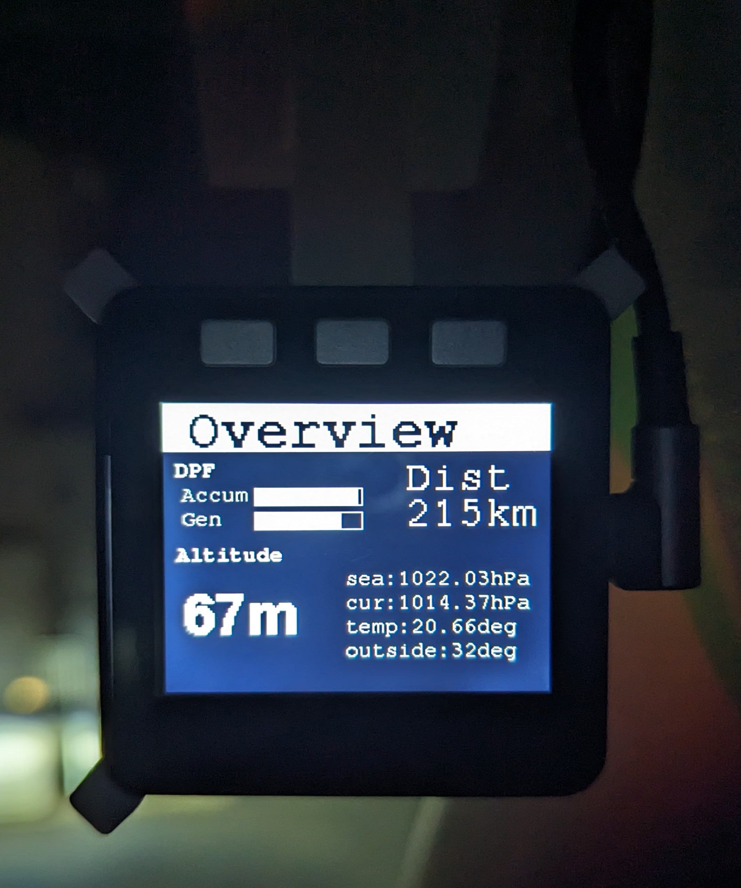
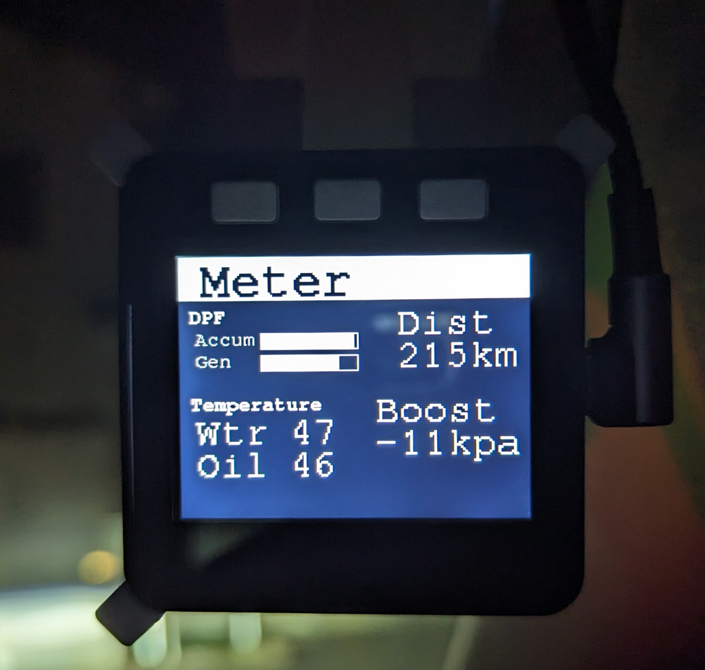
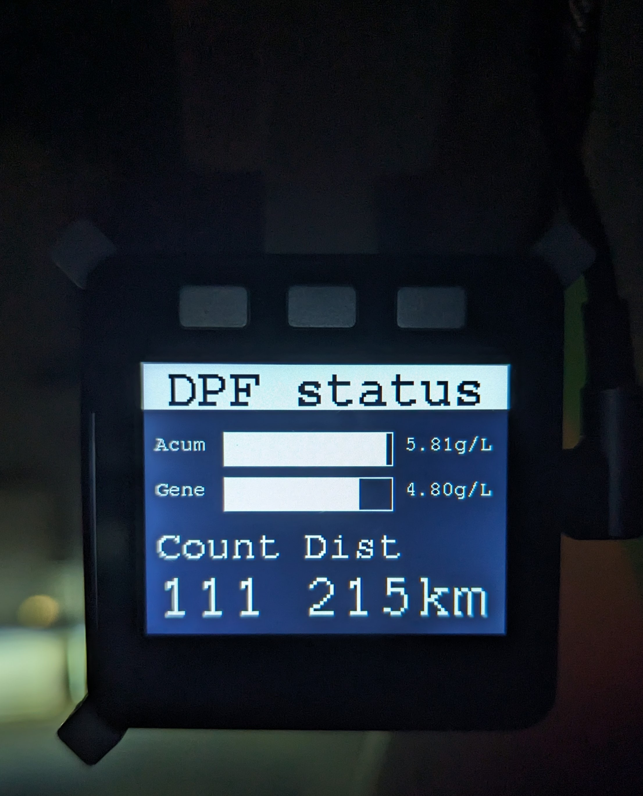
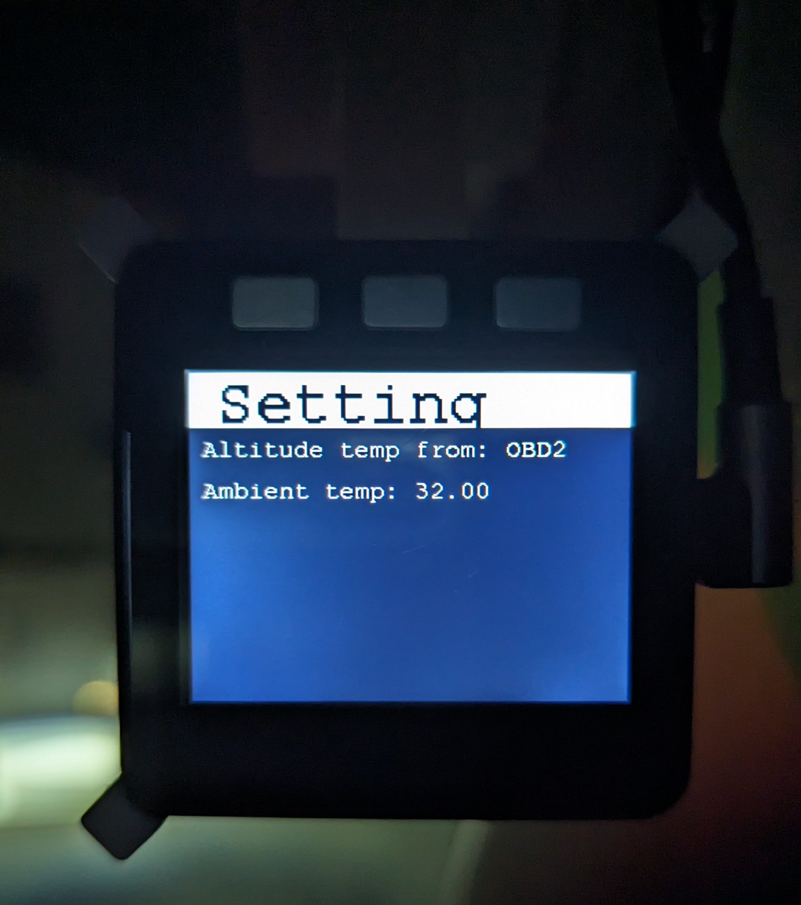

## 概要
### このプロジェクトは
このプロジェクトはM5stackで動作する、車両の情報、気圧高度をLCDに表示するソフトウェアです。

### 機能
- 気圧から高度を計算し、表示します。
  - センサはBMP280、LPS22HBに対応しています。
- (Mazdaディーゼル車のみ)DPFのステータスをbluetooth OBD2アダプタから取得し、表示します。

### 表示
- 概要表示
  - 
- メーター表示
    
- DPFステータス表示
    
- 気圧高度表示
    
- 設定表示
    - 気圧高度の気圧ソースを設定します。(センサ or OBD2による外気温)
    

### 使い方
- ボタンAとボタンCで基準気圧を設定できます。
- ボタンBで画面を切り替えます。

## 開発
### 開発環境
必要ハードウェア
- M5Stack
- BMP280
- LPS22HB
- OBD2アダプタ(bluetooth)
- 固定ホルダー(オプション。3Dプリント用のデータはSTLフォルダにあります。)

ソフトウェア
- vscode
- PlatformIO

### ビルド方法
- vscodeとPlatformIOをインストールします。
- ビルドします。

### 貢献
- プルリクエストを歓迎します。
- バグ報告、要望はissueにお願いします。対応するとは限りません。

### 固定ホルダーについて
[stl](stl)フォルダに3Dプリント用のデータがあります。  
M5stack_holderはM5stack本体にプロトモジュールをスタックさせたサイズ(約19mm)で設計しています。  
車内は熱くなるため、ABSやPETGなどの耐熱性のあるフィラメントを使用することをお勧めします。  

## ライセンス
MITです。  
詳しくは[LICENSE](LICENSE)を参照してください。  

